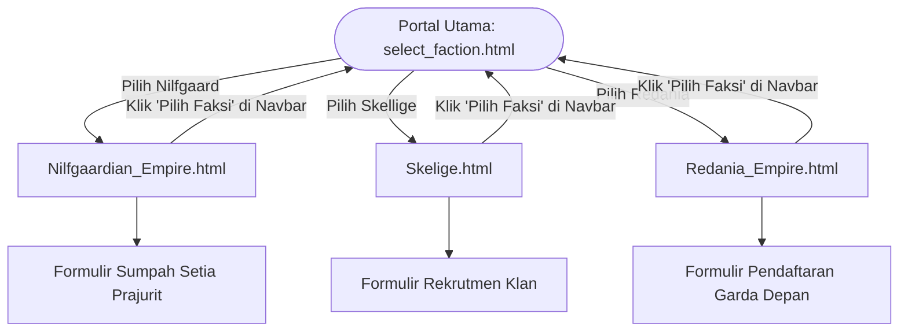

# ⚔️ The Witcher 3: Factions of the Continent

[](https://developer.mozilla.org/en-US/docs/Web/HTML)
[](https://developer.mozilla.org/en-US/docs/Web/CSS)
[](https://developer.mozilla.org/en-US/docs/Web/JavaScript)
[](https://developer.mozilla.org/en-US/docs/Web/API/Canvas_API)
[]()

> **Website interaktif tematik dunia The Witcher 3: Wild Hunt**, menyajikan visualisasi imersif tiga faksi kekaisaran dan kepulauan terbesar di Benua (*The Continent*): **Nilfgaardian Empire**, **Skellige Isles**, dan **Redania Empire**.

---

## 📌 Daftar Isi
- [Ringkasan Proyek](#-ringkasan-proyek)
- [Faksi yang Tersedia](#-faksi-yang-tersedia)
- [Fitur Utama](#-fitur-utama)
- [Teknologi yang Digunakan](#-teknologi-yang-digunakan)
- [Struktur Folder](#-struktur-folder)
- [Cara Menjalankan Website](#-cara-menjalankan-website)
- [Alur Navigasi (User Flow)](#-alur-navigasi-user-flow)
- [Kredit & Hak Cipta](#-kredit--hak-cipta)

---

## 📖 Ringkasan Proyek

Proyek ini dibangun untuk menghadirkan pengalaman interaktif bertema fantasi gelap (*dark fantasy*) khas dunia The Witcher. Pengguna dapat memilih faksi yang diinginkan di portal utama, lalu menjelajahi halaman khusus setiap faksi yang dilengkapi dengan sejarah kerajaan, profil pemimpin, katalog legiun dan persenjataan perang, serta formulir interaktif pendaftaran pasukan (*Oath of Allegiance*).

---

## 🛡️ Faksi yang Tersedia

| Faksi | Pemimpin / Simbol | Nuansa Visual | Halaman Utama |
| :--- | :--- | :--- | :--- |
| **Nilfgaardian Empire** | Kaisar Emhyr var Emreis (Matahari Emas) | ☀️ *Imperial Gold & Obsidian Dark* | `Nilfgaardian_Empire.html` |
| **Skellige Isles** | Raja Bran Tuirseach / Klan Pejuang Laut | 🌊 *Glacial Teal, Storm & Frost* | `Skelige.html` |
| **Redania Empire** | Raja Radovid V / Pasukan Elang Emas | 🦅 *Crimson Red & Iron Vanguard* | `Redania_Empire.html` |

---

## ✨ Fitur Utama

### 1. 🌌 **Interactive Faction Hub (`select_faction.html`)**
- **Dynamic Ambient Glow**: Latar belakang bereaksi mengubah aura cahaya secara *real-time* saat kursor diarahkan ke kartu faksi tertentu (Emas Nilfgaard, Teal Skellige, Merah Redania).
- **Floating Dust Particles Engine**: Efek partikel debu melayang yang dirender secara halus menggunakan HTML5 Canvas 2D.
- **Cinematic Page Transitions**: Animasi transisi *fade-out / fade-in* mulus saat berpindah antar halaman faksi.
- **Modern Glassmorphism & Hover FX**: Kartu faksi berdesain kaca modern dengan kilauan cahaya garis atas (*shimmer line*).

### 2. ☀️ **Nilfgaardian Empire (`Nilfgaardian_Empire.html`)**
- **Parallax Scroll Effect**: Judul dan spanduk kekaisaran bergerak secara dinamis seiring scroll pengguna.
- **Ash & Ember Canvas Particles**: Partikel abu melayang di seluruh layar dan percikan bara api di bagian bawah halaman.
- **Legions & Armaments Catalog**: Kartu pameran divisi pasukan kavaleri, baju zirah kekaisaran, dan persenjataan *Imperial Forge*.
- **Interactive Enlistment Form**: Formulir sumpah setia prajurit dengan validasi *real-time*, animasi *spinner transmitting*, dan respons konfirmasi status.

### 3. 🌊 **Skellige Isles (`Skelige.html`)**
- **Snow & Blizzard Canvas FX**: Efek salju dan badai dingin samudra yang jatuh di atas pemandangan kepulauan.
- **Warrior Clans Lore**: Sejarah klan pejuang laut Skellige dan perahu perang mereka.
- **Sea Armory**: Eksplorasi baju zirah tahan badai dan pedang baja khas Skellige.

### 4. 🦅 **Redania Empire (`Redania_Empire.html`)**
- **Crimson Glow & Fire Embers**: Efek partikel api menyala yang mencerminkan dominasi militer Redania di wilayah utara.
- **Radovid's War Strategy**: Narasi taktik perang dan hegemoni pasukan elang perak/emas.
- **Vanguard Enlistment**: Formulir pendaftaran garnisun tempur Redania.

---

## 🛠️ Teknologi yang Digunakan

- **HTML5**: Struktur semantik modern (`<header>`, `<section>`, `<canvas>`, `<form>`, `<aside>`, `<footer>`).
- **CSS3**:
  - CSS Custom Properties / Variables (Palet warna per faksi).
  - Modern Layouts (CSS Grid & Flexbox).
  - Glassmorphism (`backdrop-filter: blur()`).
  - Keyframe Animations (Pulse glow, shimmering lines, fade in/out).
- **Vanilla JavaScript (ES6+)**:
  - Manipulasi DOM & Event Listener interaktif.
  - HTML5 Canvas 2D Context Animation Loop (`requestAnimationFrame`).
  - Form handling & visual feedback dinamis.
- **Google Fonts**:
  - `Cinzel` & `Cinzel Decorative` (Tipografi klasik kekaisaran abad pertengahan).
  - `Montserrat` (Keterbacaan teks konten modern).

---

## 📁 Struktur Folder

```text
Witcher/
├── README.md                      # Dokumentasi utama proyek
└── Witcher_3/                     # Direktori sumber aplikasi web
    ├── select_faction.html        # Portal utama pemilihan faksi
    ├── Nilfgaardian_Empire.html   # Halaman resmi Faksi Nilfgaard
    ├── Redania_Empire.html        # Halaman resmi Faksi Redania
    ├── Skelige.html               # Halaman resmi Faksi Skellige
    │
    ├── BenderaNilfgaard.png       # Aset lambang/spanduk Nilfgaard
    ├── BenderaRedania.png         # Aset lambang/spanduk Redania
    ├── BenderaSkellige.png        # Aset lambang/spanduk Skellige
    │
    ├── Raja_NF.png                # Potret Kaisar Emhyr var Emreis
    ├── Raja_Rd.png                # Potret Raja Radovid V
    ├── raja_Skellige.png          # Potret Raja/Pemimpin Skellige
    │
    ├── Pasukan_NF.png             # Aset infanteri Nilfgaard
    ├── Pasukan_Skellige.png       # Aset prajurit klan Skellige
    ├── IronVanguard.png           # Aset pasukan elit Redania
    ├── ShadowStalkers.png         # Aset unit taktis khusus
    │
    ├── Armour_NF.png              # Baju zirah hitam berlapis emas Nilfgaard
    ├── Armour_Skellige.png        # Baju zirah kulit & rantai Skellige
    ├── ImperialForge.png          # Pandai besi & perlengkapan tempur
    ├── Weapon_NF.png              # Senjata pedang kekaisaran Nilfgaard
    └── Weapon_Skellige.png        # Senjata kapak & pedang klan Skellige
```

---

## 🚀 Cara Menjalankan Website

### Opsi 1: Menggunakan XAMPP (Localhost)
1. Letakkan folder `Witcher` ke dalam direktori root XAMPP Anda:
   ```text
   C:\xampp\htdocs\Witcher
   ```
2. Buka aplikasi **XAMPP Control Panel** dan klik **Start** pada modul **Apache**.
3. Buka browser favorit Anda (Chrome, Edge, Firefox) dan akses URL berikut:
   ```text
   http://localhost/Witcher/Witcher_3/select_faction.html
   ```

### Opsi 2: Menggunakan VS Code Live Server
1. Buka folder `Witcher` di Visual Studio Code.
2. Pastikan ekstensi **Live Server** telah terpasang.
3. Klik kanan pada file [`select_faction.html`](file:///c:/xampp/htdocs/Witcher/Witcher_3/select_faction.html) lalu pilih **"Open with Live Server"**.

### Opsi 3: Buka File Langsung di Browser
- Masuk ke folder `Witcher_3` melalui File Explorer dan klik dua kali pada file [`select_faction.html`](file:///c:/xampp/htdocs/Witcher/Witcher_3/select_faction.html).

---

## 🧭 Alur Navigasi (User Flow)



---

## 📜 Kredit & Hak Cipta

- **Universe Lore & Karakter**: Diadaptasi dari semesta novel *The Witcher* karya **Andrzej Sapkowski** dan seri game *The Witcher 3: Wild Hunt* oleh **CD PROJEKT RED**.
- **Aset & Ilustrasi**: Aset grafis tematik Witcher untuk tujuan edukasi, demonstrasi desain antarmuka, dan portofolio web frontend.
- **Pengembang**: Web Frontend Developer Portfolio Project.

---
*Dibuat dengan dedikasi dan kebanggaan untuk semesta The Witcher.* ⚔️☀️🐺
